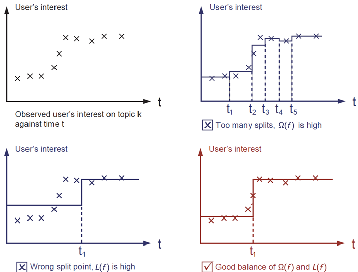

Electricity price forecasting
===================
`#DataScience` `#Python` `#MachineLearning` `#Electricityprice` `#Forecast`

## Objetive ##

The main objective of this project is to create an electricity price forecasting through the use of unusual variables such as solar thermal or hydraulic production.

The **scope of the project** is to provide a more complete and accurate way of predict electricity pricing. by applying data scientist knowledge acquired in KSchool Master in Data Science.

## About the methodology ##
XGBoost is short for "Extreme Gradient Boosting", where the term "Gradient Boosting" is proposed in the paper Greedy Function Approximation: A Gradient Boosting Machine, by Friedman. XGBoost is based on this original model. 

### Data acquisition

The data set was provided by Meteologica S.A. and consists in 8 `csv` file containing date an production of different energy sources.

|DATA|UNITS|ALIAS|
|----|------|-----|
|Date|set in UTC time zone|date|
|Price electricity|cent€/kWh|price|
|Wind Power production|kW|wind|
|Photovoltaic Power production|kW|photo|
|Energy Demand|kW|demand|
|Temperature|dK|temp|
|Solar Thermal Power production|kW|thermo|
|Hydraulic Availability|kW|hydro_disp|
|Hydraulic Production|kW|hydro_prod|

### Exploratory data analysis (EDA)

The main tasks during this phase were transforming data, dealing with missing values, and create an homogeneous data set to finally testing and fitting a statistical model.

#### Variable transformation
Variables were converted into a their right object type and also changed from its measurement scale. 

Working with categorical or factor variables in a big data set can be challenging. By transforming into the write object type we could minimize computational resources.

**Files**:

 1. [`reading.py`](reading.py): a python **script** that reads the data source file, performs data cleaning and create test, validate an train files.
 2. [`analysis.R`](analysis.R): a R **script** that analyzes the data and studies the importance of the variables.

### Modelling

This is the core activity of the data science project. In order to get insight from the data a Machine Learning algorithm was applied to the selected variables.

**XGBoost visually explained**

**Files**:

1. [`xgboost_jupyter.ipynb`](xgboost_jupyter.ipynb): a Jupyter Notebook that generates the predictions using Xgboost. 

### Data analysis and visualization

The last phase in this project was trying to  communicate information clearly and efficiently through plotting the results. 

**Files**

 1. [`Plot.ipynb`](plot.ipynb): A vegalite plotting of the results.
 
## About the technology ##
#### Programming languages and interpreters

 - Linux shell: Shell was used intensively to manage files and run scripts.
 - Pycharm: IDE used to create .py files
 - *R** statistical language: Was used mainly for the variables importance analysis.

#### Main libraries

 - `xgboost`:
 
 `> pip install xgboost`
 
  - `sklearn`:
  
 `> pip install sklearn`
 
 - R `plyr`:  is a R set of tools for a common set of problems: you need to split up a big data structure into homogeneous pieces, apply a function to each piece and then combine all the results back together. 
 
 - R `caTools`: Contains several basic utility functions including: moving (rolling, running) window statistic functions, read/write for GIF and ENVI binary files, fast calculation of AUC, LogitBoost classifier, base64 encoder/decoder, round-off-error-free sum and cumsum, etc
 
 - R `ROCR`: is a R package for visualization
 
 - `Pandas`: A high-performance, easy-to-use data structures and data analysis tools for Python
 - `Altair`: Declarative Visualization in Python
  
 `> conda install -c conda-forge altair vega_datasets notebook vega`
 
#### Hardware and Resources

 - DELL Optiplex GX 7010 Intel Core i5-3470, 8GB de RAM, Disco SSD de 240GB

## How to run this analysis

**Reading and transforming**

    python reading.py

**R analysis** 
(set your own path at setwd("~/PycharmProjects/master-data-science"))

    rstudio analysis.R 

**Modelling and output** 

    jupyter-notebook xgboost_jupyter.ipynb 
    
**Plotting results** 

    jupyter-notebook Plot.ipynb 

## About the author

**Clara Godoy Morales**
Analyst and programmer at Meteologica S.A.
 - https://www.linkedin.com/in/claragodoy/